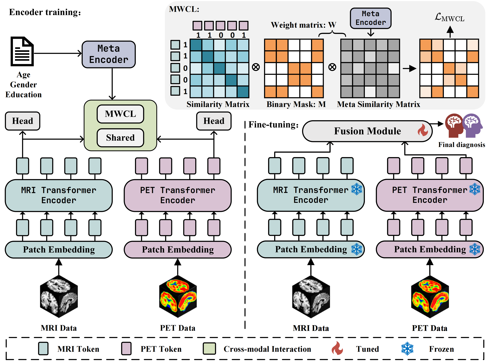

# UniCross
UniCross: Balanced Multimodal Learning for Alzheimer’s Disease Diagnosis by Uni-modal Separation and Metadata-guided Cross-modal Interaction

## Content 

- [Introduction](#Introduction)
- [Train steps](#Train-steps)
- [License](#License)
- [Thanks](#Thanks)

### Introduction

This repo is for the MICCAI 2025 accepted paper UniCross: [link](https://papers.miccai.org/miccai-2025/0972-Paper2409.html)

### Train steps
1. Download Dataset (FDG-PET and sMRI and ADNIMERGE table) from [ADNI](https://adni.loni.usc.edu/)
2. Data Pre-Processing
3. Train Stage1 and Train Stage2

# 说明 (2026.2.1):
- `Data/` 文件夹包含 `Group_Subject_id.csv` 以及 MRI 与 PET 的 `image id` 列表；其中 `image id` 可用于在 ADNI 上直接下载对应影像。
- 在 ADNI 数据库中批量检索 `image id` 时，可能出现部分结果缺失；需要先找出未返回的 `image id`，再逐个单独查找。
- 论文中 sMCI 的样本数应为 191（而非 192），因此总 subject 数为 1043。
- `Data/clinical_data.zip` 为临床数据，已经处理好并转换为 `pt` 格式。
- 数据预处理可参考这篇 [Blog](https://sidiexplore.xyz/2023/03/18/SynthStrip/)，以尽量减少预处理耗时。

# Note (2026.2.1):
- The `Data/` folder contains `Group_Subject_id.csv` and the MRI/PET `image id` lists; these `image id`s can be used to directly download the corresponding images from ADNI.
- When querying multiple `image id`s in bulk on ADNI, some results may be missing; you may need to identify the `image id`s that were not returned and query them one by one.
- The number of sMCI subjects reported in the paper should be 191 (not 192); therefore, the total number of subjects is 1043.
- `Data/clinical_data.zip` has been processed and converted to `pt` format.
- For data preprocessing, you may refer to this [blog post](https://sidiexplore.xyz/2023/03/18/SynthStrip/) to minimize preprocessing time.

### License

Distributed under the MIT License. See [`LICENSE`](https://github.com/shaojintian/Best_README_template/blob/master/LICENSE.txt)for more information.

### Thanks

- [ViT_recipe_for_AD](https://github.com/qasymjomart/ViT_recipe_for_AD)
- [DI-MML](https://github.com/fanyunfeng-bit/DI-MML)
- [SupConLoss](https://github.com/XG293/SupConLoss)

### WeChat
- YinSong-zzz
- 欢迎交流

